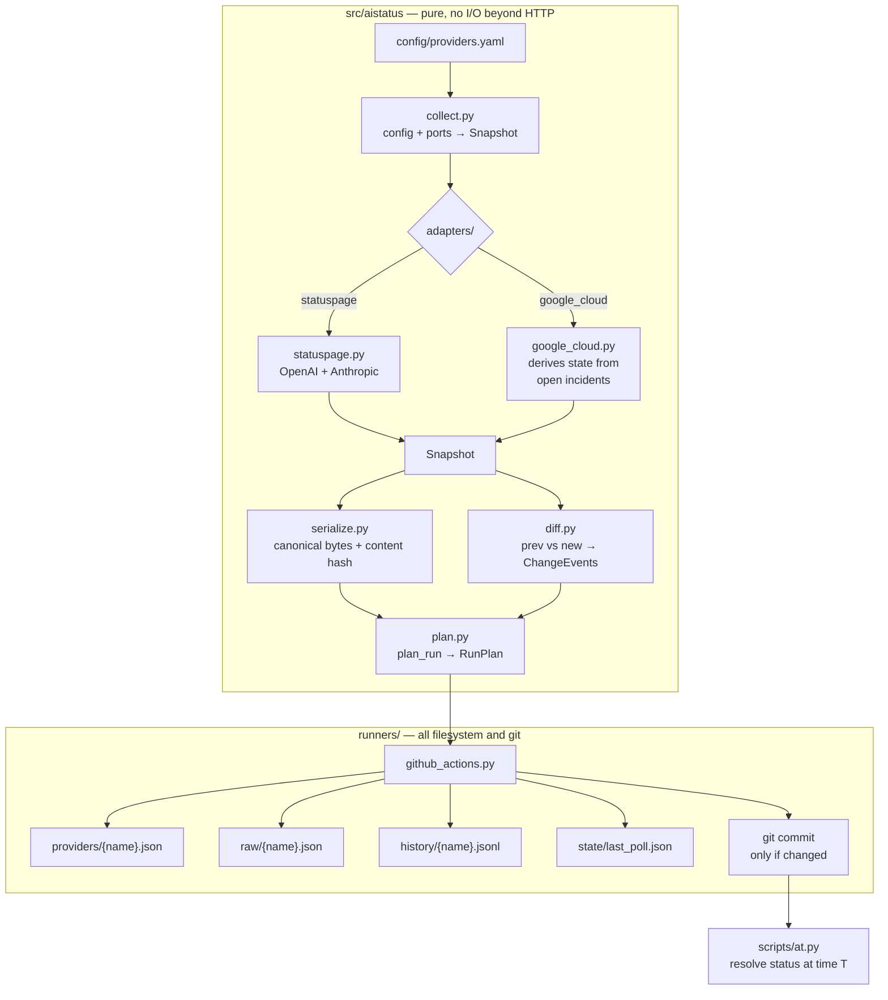

# ai-status-archive

A git-native historical record of AI provider service status.

A GitHub Actions cron job polls each provider's public status endpoint every five
minutes, normalizes the response, and **commits only when something actually
changed**. The git history *is* the time-series database.

The purpose is forensic, not alerting. When a production system fails at 03:14
UTC on some past date, this repo answers *"was the Anthropic API degraded at that
moment?"*:

```bash
python scripts/at.py --provider anthropic --at 2026-09-14T03:14:00Z
```

---

## Table of contents

- [What this is and isn't](#what-this-is-and-isnt)
- [Limitations — read this first](#limitations--read-this-first)
- [How it works](#how-it-works)
- [Normalized schema](#normalized-schema)
- [Prerequisites](#prerequisites)
- [Install](#install)
- [Run](#run)
- [Query recipes](#query-recipes)
- [Test](#test)
- [Adding a provider](#adding-a-provider)
- [Providers covered](#providers-covered)
- [Commit policy](#commit-policy)
- [GitHub Actions operational realities](#github-actions-operational-realities)
- [Backfill](#backfill)
- [Repository layout](#repository-layout)
- [Assumptions](#assumptions)
- [Delete / tear down](#delete--tear-down)
- [License](#license)

---

## What this is and isn't

**It is** a contemporaneous, append-only record of what three providers' status
pages said, sampled every five minutes, with enough provenance to reconstruct any
past moment and to detect when a provider later rewrote their own history.

**It is not** an alerting system, a dashboard, a status page, or a measurement of
whether the APIs actually worked. There is no web UI, no database, no
notifications, and no active probing. Those omissions are deliberate.

---

## Limitations — read this first

> ### Status pages are self-reported
>
> Every byte in this archive originates from the provider's own publishing
> decisions. Providers decide what counts as an incident, when to post it, which
> components to mark degraded, and when to close it.
>
> **Status pages lag reality.** An outage is typically live for minutes to tens of
> minutes before it appears on a status page, because a human usually has to
> decide to post it.
>
> **Status pages routinely understate partial degradation.** Elevated latency,
> elevated error rates on a subset of models, regional capacity problems, and
> rate-limit tightening frequently never appear at all.
>
> **Therefore: the absence of a recorded incident is weak evidence that a provider
> was healthy.** A clean result from `scripts/at.py` means "they did not say
> anything was wrong", which is a much weaker claim than "nothing was wrong."
> Presence of an incident is strong evidence; absence is not.

The planned follow-up is actively probing real inference endpoints and recording
observed latency and error rates. That would produce evidence independent of the
provider's own narrative. It is explicitly out of scope here.

### Further limitations, specific to today's upstreams

- **OpenAI incidents cannot be attributed to components.** OpenAI's Statuspage
  generation publishes no `components[]` on incidents, so `affected_components`
  is always empty for OpenAI. You can see *that* OpenAI had an incident and *that*
  a component was degraded, but not that the two are linked.
- **OpenAI publishes no scheduled maintenances.** The key is absent from
  `summary.json` and `/api/v2/scheduled-maintenances.json` returns 404.
- **OpenAI's component `updated_at` is meaningless.** All 25 components report one
  identical bulk timestamp that does not track per-component change. It is
  preserved as the provider's own claim but excluded from change detection.
- **Google's coverage is products-we-chose-wide, not AI-wide.** The feed is
  platform-wide across all of GCP and filtered here to 57 configured product IDs.
  An AI outage filed only against an unlisted product will not appear.
- **Google's status is derived, not reported.** Google publishes no component
  states, so per-product status is inferred from which incidents are open. A
  degradation Google never files as an incident is invisible.
- **Coverage gaps are possible and are surfaced, not hidden.** `scripts/at.py`
  flags any query whose nearest poll is more than ten minutes away.

---

## How it works



The boundary between the two boxes is load-bearing. `collect.py`, `plan.py`,
`diff.py`, `serialize.py`, and the adapters read no files, run no git, consult no
environment variables, and emit no logs. `tests/test_purity.py` walks their ASTs
to enforce it, so the property cannot quietly rot — and a future AWS Lambda poller
can reuse them verbatim. See `runners/lambda_handler.py`.

`plan_run()` returns a `RunPlan`: an explicit list of byte-level writes plus an
optional commit. The runner only executes it. That is why `--dry-run` is a single
branch with no duplicated logic.

---

## Normalized schema

Every provider normalizes to the same structure, regardless of source platform.

```json
{
  "schema_version": 1,
  "provider": "anthropic",
  "provider_name": "Anthropic",
  "source_platform": "statuspage",
  "source_url": "https://status.claude.com/api/v2/summary.json",
  "overall": {
    "indicator": "none | minor | major | critical | maintenance | unknown",
    "description": "All Systems Operational"
  },
  "components": [
    {
      "id": "k8w3r06qmzrp",
      "name": "Claude API (api.anthropic.com)",
      "group": null,
      "status": "operational | degraded_performance | partial_outage | major_outage | under_maintenance | unknown",
      "updated_at": "2026-09-15T11:14:44Z"
    }
  ],
  "active_incidents": [
    {
      "id": "abc123",
      "name": "Elevated error rates on the Messages API",
      "status": "investigating | identified | monitoring | resolved | postmortem",
      "impact": "none | minor | major | critical",
      "started_at": "2026-09-14T17:45:00Z",
      "updated_at": "2026-09-14T18:02:11Z",
      "resolved_at": null,
      "affected_components": ["k8w3r06qmzrp"],
      "url": "https://status.claude.com/incidents/abc123",
      "latest_update": "We are investigating elevated error rates.",
      "latest_update_id": "u1",
      "latest_update_sha12": "9f3c1a77b204"
    }
  ],
  "scheduled_maintenances": [],
  "fetch": {
    "ok": true,
    "fetched_at": "2026-09-15T12:19:09Z",
    "http_status": 200,
    "error": null,
    "etag": "W/\"5bb951fe...\"",
    "last_modified": null,
    "content_hash": "sha256:8606117a...",
    "elapsed_ms": 143
  }
}
```

### Rules

- **All timestamps are UTC, ISO 8601, `Z`-suffixed, second precision.** No local
  time anywhere, ever. Sub-second precision is truncated rather than rounded,
  because rounding is not monotone across a second boundary.
- **`fetched_at` is the real HTTP completion time**, never the workflow's
  scheduled time. GitHub's cron drifts; recording the intended time would
  silently corrupt the timeline.
- **The provider's own timestamps are preserved alongside ours.** `started_at`
  and `updated_at` are their claims; `fetched_at` and history `at` values are our
  observations. These are different facts and both are needed.
- **Stable IDs are the only keys.** Display names are recorded but never used to
  identify anything.

### The `fetch` block is excluded from change detection

The content hash covers an explicit allowlist of change-significant fields, not
"everything except `fetch`". The distinction matters: OpenAI's shared bulk
`component.updated_at` would otherwise churn the hash and commit junk every time
they touched it. Also excluded: incident `updated_at` (cosmetic re-saves),
`latest_update` text (Google attaches full postmortems, rewritten weeks later),
and the page `description` blurb. Component and incident **renames are included**,
because a rename is a real, dateable fact.

### History event types

`history/{provider}.jsonl` is append-only, one JSON object per line:

```json
{"at":"2026-09-15T03:14:00Z","change_type":"component_status","component_id":"k8w3r06qmzrp","from":"operational","to":"degraded_performance","incident_id":null,"provider":"anthropic"}
```

| `change_type` | Meaning |
|---|---|
| `baseline` | First observation of this provider. **Addition to the original spec** — one marker instead of one event per component, because a 25-line burst for OpenAI would be indistinguishable from a real 25-component incident when grepping, and would skew every "count the outages" query by the bootstrap. |
| `overall_indicator` | Page-level indicator changed. |
| `component_status` | One component's status changed. `from: null` means newly tracked; `to: null` means no longer published. |
| `component_renamed` | **Addition to the original spec.** A component's display name changed with no status change. Google is renaming its entire Vertex AI line to "Agent Platform" right now, and this is what lets you later explain why a file changed on a day nothing broke. |
| `incident_opened` | New incident ID appeared. |
| `incident_updated` | Status changed, or a new update was posted. When `from == to`, that equality is the marker for "new update, same status". |
| `incident_resolved` | Status went terminal, or the incident disappeared from the feed (which is how Statuspage signals resolution). |

`at` is **our observation time**. The honest claim this archive makes is "we
observed X by time T", bounded by the poll interval.

---

## Prerequisites

- **Python 3.12** (pinned in `.python-version`; also the safest AWS Lambda managed
  runtime for the planned follow-up).
- **[uv](https://docs.astral.sh/uv/)** for dependency management.
- **git**.
- The only runtime dependency is **PyYAML**. Everything else is standard library,
  which is what keeps Actions runs under a minute and Lambda packaging trivial.

---

## Install

```bash
git clone https://github.com/junxit/ai-status-archive.git
cd ai-status-archive
uv sync
```

`uv` will fetch Python 3.12 automatically if it is not already present.

---

## Run

```bash
# Show what would happen without touching git. Performs real HTTP.
uv run python runners/github_actions.py --dry-run

# Real run: writes files and commits only if something changed.
uv run python runners/github_actions.py

# Immediately again — this must produce NO commit.
uv run python runners/github_actions.py
```

### Runner flags

| Flag | Effect |
|---|---|
| `--dry-run` | Print the planned writes and commit; touch nothing. |
| `--no-push` | Commit locally without pushing. |
| `--provider NAME` | Poll only this provider. Repeatable. |
| `--allow-dirty` | Skip the clean-working-tree guard. |
| `--config PATH` | Alternate `providers.yaml`. |
| `--repo-root PATH` | Write into a different repository. |
| `--run-url URL` | Recorded as a commit trailer. |
| `--timeout SECONDS` | Per-request timeout, default 10. |

### Exit codes

| Code | Meaning |
|---|---|
| `0` | Normal, including a partial fetch failure. |
| `1` | Unexpected error, or no provider matched `--provider`. |
| `2` | **Every** provider failed — suggests our network or config, not theirs. |
| `3` | Dirty working tree; commit, stash, or pass `--allow-dirty`. |

A partial failure exits zero deliberately. A red X every time one status page
hiccups trains whoever inherits this to ignore the alert, and the failure is
already recorded in `history/_fetch_failures.jsonl`.

---

## Query recipes

```bash
# What was Anthropic's status at a past instant?
uv run python scripts/at.py --provider anthropic --at 2026-09-14T03:14:00Z

# Same, plus the change timeline two hours either side.
uv run python scripts/at.py --provider openai --at 2026-09-14T03:14:00Z --window 2h

# Machine-readable, for piping.
uv run python scripts/at.py --provider google --at 2026-09-14T03:14:00Z --json | jq .coverage
```

`at.py` exits `0` when the instant is covered and `1` when it is not, so it
composes in scripts.

**Coverage is judged from the heartbeat, not the commit date.** Because the poller
commits only on change, the commit in effect at a given instant may legitimately
be days old — that means "nothing changed", not "nothing was recorded". So
`at.py` resolves `state/last_poll.json` on both sides of the instant and reports
the gap explicitly. Without that, a long quiet stretch looks like a gap and a real
gap looks quiet.

### Raw git recipes

```bash
# Every version of Anthropic's normalized state, with diffs.
git log -p --follow -- providers/anthropic.json

# Compact index of every status commit.
git log --format='%H %cI %s' -- providers/

# Every recorded incident opening, across all providers.
git log -S'"change_type":"incident_opened"' --format='%cI %s'

# All component transitions for the Claude API component.
grep '"component_id":"k8w3r06qmzrp"' history/anthropic.jsonl | jq -c '{at,from,to}'

# Every degradation this year, any provider.
grep -h 'degraded_performance\|partial_outage\|major_outage' history/*.jsonl | jq -c .

# When did we fail to reach a provider?
jq -c '{at,provider,kind}' history/_fetch_failures.jsonl

# Did a provider rewrite an incident after the fact? Diff the raw payloads.
git log -p -- raw/anthropic.json | grep -A2 -B2 'started_at'

# Prove continuous coverage across a window.
git log --format='%cI' --since=2026-09-01 --until=2026-09-02 -- state/last_poll.json
```

---

## Test

```bash
uv run pytest              # full suite, ~150 tests, a few seconds
uv run pytest -v           # verbose
uv run pytest tests/test_plan.py    # just the commit state machine
```

The suite covers, in rough order of importance:

- **Idempotence** — identical input twice produces no commit, no history lines,
  and byte-identical files. This is the single most important behavior.
- **Failure isolation** — timeouts, malformed JSON, and a schema change that
  empties the component list all leave `providers/*.json` untouched.
- **Byte stability** — same input, same bytes; shuffled dict order, same bytes;
  floats rejected outright.
- **Hash scope** — proves what does and does not affect the content hash.
- **Adapter fidelity** — asserts specific stable IDs against payloads recorded
  live, so a provider reorganization is a **red test**, not silently empty JSON.
- **Purity** — AST guards on imports and wall-clock calls in the pure layer.
- **Mixed outcomes** — changed + failed + 304 in one cycle writes the right
  partial set.

---

## Adding a provider

For a provider on an already-supported platform, this is a config edit only:

```yaml
  - name: newprovider
    display_name: New Provider
    platform: statuspage
    url: https://status.newprovider.com/api/v2/summary.json
    api_components:
      - "abc123"  # whichever component means "the API"
```

Then create the empty archive files and run once to establish a baseline:

```bash
uv run python runners/github_actions.py --provider newprovider
```

For a genuinely new platform:

1. Add `src/aistatus/adapters/yourplatform.py` exposing `PLATFORM` and a `parse()`
   matching the `ParseFn` protocol.
2. Register it in `src/aistatus/adapters/__init__.py`.
3. Record a real payload into `tests/fixtures/` and write tests asserting stable
   IDs survive parsing.
4. Add the entry to `config/providers.yaml`.

**Fetch the endpoint and read the real response before writing the adapter.**
Every schema assumption in the original plan for this project turned out to be
wrong in at least one respect. Add the module to `PURE_MODULES` in
`tests/test_purity.py` so the no-clock guard applies to it.

---

## Providers covered

| Provider | Platform | Components | Conditional requests |
|---|---|---|---|
| OpenAI | Statuspage (rebuilt generation, ULID IDs) | 25 archived, 14 tagged API-relevant | **No validators sent at all** |
| Anthropic | Statuspage (classic) | 6 archived, 2 tagged | **Yes — real ETag and real 304** |
| Google Cloud | Custom incident feed | 57 tracked product IDs | Advertises `Last-Modified`, **ignores `If-Modified-Since`** |

`status.anthropic.com` redirects to `status.claude.com` and the page is titled
"Claude"; the canonical host is polled directly to skip the hop.

Google's product filter is on **stable IDs**, never display names. Google's own
published schema says `id` "is stable" while `title` "is unstable and could change
without warning" — and 14 catalog entries already show a rename in flight:

```
Z0FZJAMvEB4j3NbCJs6B  Vertex Gemini API           → Gemini on Agent Platform
sdXM79fz1FS6ekNpu37K  Vertex AI Online Prediction → Agent Platform Online Inference
```

A name-based filter would silently start matching nothing partway through.

---

## Commit policy

**Commit only when state changes.** At 288 runs/day across 3 providers,
committing unconditionally would produce roughly 100,000 junk commits a year.

Three triggers, any one of which fires a commit:

1. **Some provider's normalized state changed** (or was seen for the first time).
2. **The heartbeat is due** — the UTC hour rolled over since the last committed
   heartbeat. Caps heartbeat commits at 24/day.
3. **A provider's failure streak crossed zero** in either direction. Without this,
   a multi-hour upstream outage would be recorded only by hourly heartbeats, and
   the ephemeral runner would discard the uncommitted failure lines entirely.
   Bounded at two extra commits per episode.

### Why a heartbeat at all

Commit-on-change alone cannot distinguish *"Anthropic was stable for nine days"*
from *"the poller died nine days ago"* — exactly the ambiguity that ruins a
forensic dataset. `state/last_poll.json` records the last successful fetch per
provider and proves continuous coverage.

`heartbeat_committed_at` is stored **inside** that file rather than derived from
`git log`. This is not stylistic: `actions/checkout` defaults to `fetch-depth: 1`,
where `git log -1 -- state/last_poll.json` returns empty whenever the last change
to that path predates the single fetched commit. Deriving cadence from commit
metadata would break silently as soon as the repo had history.

Hour buckets are used rather than a 60-minute delta because a delta ratchets
forward under cron drift (61 → 65 → 71 minutes) and undershoots 24/day
unpredictably.

### Fetch failures are not status changes

If a request times out, returns 5xx, or returns something unparseable, the runner
does **not** overwrite `providers/{name}.json` with an "unknown" status — that
would look identical to a real outage in the history and poison the dataset.
Instead the last known good file is left untouched and a line is appended to
`history/_fetch_failures.jsonl`.

**Our inability to reach a status page is a fact about us, not about the
provider.**

### Commit messages

```
chore(status): 2026-09-14T18:35Z anthropic claude_api_api_anthropic degraded_performance
chore(status): 2026-09-14T18:35Z heartbeat
```

The UTC timestamp is included because `git log --oneline` shows no dates and
scanning this archive by eye is a primary workflow. The subject names only
components tagged `api_components`, so a Sora blip does not dominate a line that
should be about whether the API is up. The body embeds the change events verbatim,
which is what makes `git log -S` and `git log --grep` useful.

---

## GitHub Actions operational realities

These will bite whoever inherits this.

- **Five minutes is GitHub's hard minimum** for cron granularity. There is no way
  to poll faster on Actions; that is what the Lambda seam is for.
- **Scheduled runs are best-effort.** They get delayed — sometimes by 15 minutes
  or more — and can be dropped entirely during peak load, which is worst at the
  top of the hour. The schedule is deliberately offset to `3-58/5` rather than
  `*/5` to dodge the crowd. **This is also precisely why `fetched_at` records the
  real fetch time.**
- **Scheduled workflows in public repos are auto-disabled after 60 days of
  repository inactivity.** Commits made with the default `GITHUB_TOKEN` are
  attributed to `github-actions[bot]` and **may not reset that clock** — meaning a
  repo whose only activity is its own poller can still be disabled.
  `keepalive.yml` mitigates this but cannot fully solve it without a PAT; see the
  comments in that file. Set a `KEEPALIVE_TOKEN` secret (fine-grained PAT,
  Contents: write) for the reliable path, and make sure GitHub's warning email
  reaches a human who will act on it. `workflow_dispatch` on `poll.yml`
  re-enables a disabled schedule in one click.
- **Actions minutes are free and unlimited on public repos.** On a private repo
  the free tier is 2,000 minutes/month, and 288 runs/day at roughly a minute each
  is about 8,700 minutes/month — over four times the allowance. This repo is
  public for that reason.
- **`concurrency: { group: poll, cancel-in-progress: false }`** is required.
  Overlapping runs racing on a push would corrupt the archive, and cancelling
  loses an observation.
- **`history/*.jsonl` uses `merge=union`** (see `.gitattributes`) so that a
  rebase after a collision merges concurrent appends instead of raising a
  conflict the unattended runner cannot resolve.

### Politeness

A descriptive `User-Agent` identifying this repo is sent on every request, never
the default Python agent — the CDN in front of Statuspage will sometimes reject
that outright. Timeouts are 10 seconds, retries are capped at 2 with exponential
backoff plus jitter, `Retry-After` is honored, and the three providers are
staggered ~1.5 seconds apart rather than fired in parallel.

Statuspage's *public* status API is not rate-limited — the documented 60/min limit
applies to the authenticated Manage API — so five-minute polling is well within
norms. Being polite anyway is how it stays that way.

---

## Backfill

```bash
uv run python scripts/backfill.py
```

Writes provider-published incident history to `history/_backfill/{provider}.json`,
deliberately in a separate namespace with a provenance banner on every file.

**Never merge backfill with live-collected data.** Backfilled incidents are
post-hoc provider narratives: written after the fact, timestamped in hindsight,
and routinely edited later. Our own snapshots are contemporaneous observations.
Being able to tell the difference is the whole point of this archive.

Coverage as of the initial run: OpenAI 25 incidents, Anthropic 50, Google 6.
Google's feed is a rolling window of significant platform incidents rather than a
deep archive, so its backfill is thin by upstream design.

---

## Repository layout

```
.github/workflows/    poll.yml (*/5 cron) and keepalive.yml
config/providers.yaml the provider registry — adding one is an edit here
src/aistatus/
  models.py           normalized schema types, all frozen dataclasses
  fetch.py            urllib HTTP with retries, timeouts, conditional requests
  adapters/           statuspage.py, google_cloud.py, and the registry
  collect.py          PURE: config + injected ports → Snapshot
  diff.py             PURE: two snapshots → change events
  plan.py             PURE: the commit decision state machine → RunPlan
  serialize.py        PURE: canonical bytes and content hashing
runners/
  github_actions.py   all filesystem and git; executes a RunPlan
  lambda_handler.py   documented stub — S3/DynamoDB sketch, not implemented
scripts/
  at.py               "what was the status at time T?"
  backfill.py         one-time pull of provider-published history
providers/{name}.json current normalized state — git history holds every version
raw/{name}.json       last raw upstream payload, key-sorted
history/{name}.jsonl  append-only change log — the file you will actually grep
history/_fetch_failures.jsonl   our failures, kept separate from their outages
history/_backfill/    post-hoc provider narratives, never merged with the above
state/last_poll.json  liveness heartbeat
tests/fixtures/       real payloads recorded 2026-09-15
```

---

## Assumptions

- **Public repository.** Required for free unlimited Actions minutes at this poll
  rate. If it must go private, budget roughly 8,700 minutes/month or reduce the
  frequency.
- **The archive is append-only in spirit.** Nothing rewrites history. If you ever
  need to correct a bad record, add a new commit explaining it rather than
  rebasing, or the forensic guarantee is gone.
- **`git show HEAD:` is the source of truth for previous state**, not the working
  tree. If a run writes its files and then dies before committing, comparing
  against the working tree would conclude "unchanged" on the next pass and lose
  that transition permanently.
- **One UTC hour is an acceptable liveness resolution.** Heartbeat commits prove
  coverage to within an hour; individual polls are recorded at five-minute
  resolution inside `state/last_poll.json` only for the most recent poll.
- **Providers do not require authentication** for these endpoints, and none is
  configured. No secrets are needed to run this, except the optional
  `KEEPALIVE_TOKEN`.
- **57 Google product IDs is the right AI surface.** Broad by choice; three
  substring artifacts (*Cont**ai**ner Registry*, *Cloud Dom**ai**ns*, *Unified
  M**ai**ntenance*) were excluded from a naive keyword sweep.

---

## Delete / tear down

```bash
# Stop polling but keep the data: disable the workflows.
gh workflow disable poll --repo junxit/ai-status-archive
gh workflow disable keepalive --repo junxit/ai-status-archive

# Remove local build artifacts only.
rm -rf .venv .pytest_cache **/__pycache__

# Delete the whole repository, including all archived history. Irreversible.
gh repo delete junxit/ai-status-archive --yes
```

Deleting the repository destroys the dataset — there is no other copy. Consider
`gh repo archive` instead, which freezes it read-only and stops the schedule while
preserving everything.

---

## License

Proprietary — all rights reserved. Copyright (c) 2026 Jade Naaman. See
[LICENSE](LICENSE).

Files under `providers/`, `raw/`, `history/`, and `state/` reproduce publicly
published status information belonging to OpenAI, Anthropic, and Google. Those
payloads remain the property of their publishers; the copyright claimed here
covers this project's source, schema, and compilation of that data.
